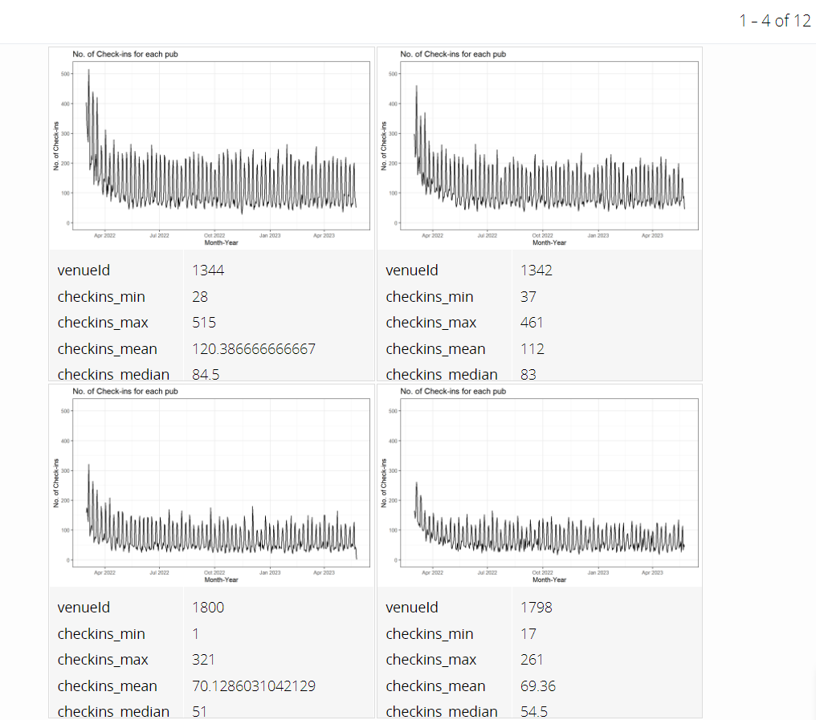
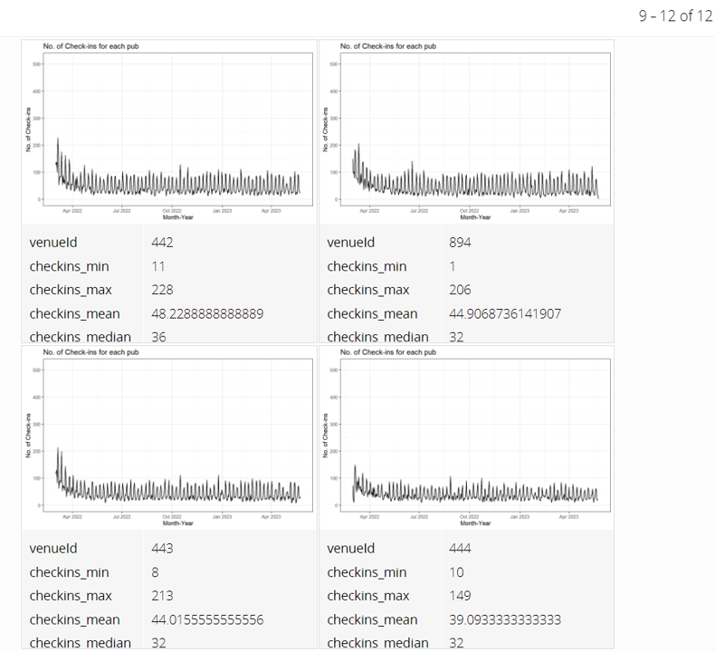

```{r setup, include=FALSE}
knitr::opts_chunk$set(echo = TRUE, evaluation = TRUE, message = FALSE, warning = FALSE, fig.retina = 3)

```

# 1. Overview

Take-home Exercise #3: To reveal the economic of the city of Engagement, Ohio USA by using appropriate static and interactive statistical graphics methods


## 1.1 The Task

In this exercise, we are going to consider the financial status of Engagement’s businesses and residents, and use visual analytic techniques to address below questions:

- Over the period covered by the dataset, which businesses appear to be more prosperous? Which appear to be struggling? Describe the rationales. 


The data should be processed by using appropriate **tidyverse** family of packages and the statistical graphics should be prepared using **ggplot2** and its extensions.

# 2. Getting Started
## 2.1 Installing and loading the required libraries

Before we get started, it is important for us to ensure that the required R packages have been installed.  For the purpose of the exercise, the **tidyverse** packages will be mainly used.

The code chunk below is used to check if the necessary R packages are installed in R.  If they have yet, then RStudio will install the missing R package(s).  If are already been installed, then they will be loaded in R environment.

```{r}
packages = c('tidyverse', 'knitr', 'rmarkdown', 'trelliscopejs', 'ggiraph', 'plotly', 'gganimate')
for(p in packages){
  if(!require(p, character.only = T)){
    install.packages(p)
  }
  library(p, character.only = T)
}
```


# 3. Data Import
## 3.1 Import *CheckinJournal.csv*
In this exercise, *CheckinJournal.csv* csv data file in the *Journals* folder will be used.

The code chunk below imports *CheckinJournal.csv* into R environment by using *read_csv()* function.

```{r}

checkin_journal <- read_csv("data/CheckinJournal.csv")

paged_table(checkin_journal)

```

# 4. Data Wrangling

For this exercise, we are going to focus on the analysis of Pubs. There are 12 pubs in total  in the town. 
We need to filter out the check-ins for pubs only using *filter()* function. 
Meanwhile, we will also change the format of timestamp to date format using *as.Date()* function. 

```{r}

checkin_journal$timestamp <- as.Date(checkin_journal$timestamp)
checkin_journal_pub <- checkin_journal %>%
  filter(`venueType` == "Pub")

```

Next we are going to group the check-in data by *venueId* and *timestamp* using *group_by()* and *summarise()* functions.
In this way, we will know within one day how many check-ins occured for each pub. 

```{r}
checkin_pub <- checkin_journal_pub %>%
  group_by(`venueId`, `timestamp`) %>%
  summarise('checkins' = n()) %>%
  ungroup()

paged_table(checkin_pub)

```


# 5. Data Visualization

## 5.1 No. of check-ins for pubs using ggiraph 

With **ggiraph**, we are able to plot the daily change of no. of check-ins for all the pubs in one line chart using *geom_line_interactive()* function. 
We will also add in tooltip with pub ID and color the lines by pubs. 
In *girafe()* function, we can adjust *opts_hover_inv()* and *opts_hover()* so that the line chart of one particular pub will be highlighted upon mouse over whereas the other lines will become more transparent.

However, due to the large number of pubs, this graph is still not clear enough to show the check-in trend of individual pub due to overlapping. 

```{r}
checkin_pub$venueId <- as.character(checkin_pub$venueId)

p1 <- ggplot(data=checkin_pub)+
  geom_line_interactive(aes(x = timestamp, 
                            y = checkins,
                            tooltip = paste0("Pub ID: ", venueId),
                            data_id = venueId, 
                            color = venueId,
                            group = venueId )
                        ) +
  scale_color_viridis_d() + 
  labs(x ="Month-Year", y = "No. of Check-ins", 
       title = "No. of Check-ins for pubs") 

girafe(                                  
  ggobj = p1,                             
  width_svg = 8,                         
  height_svg = 8*0.618,
  options = list(                        
    opts_hover_inv(css = "opacity:0.1;"),
    opts_hover(css = "stroke-width:2;")
  )                                        
)


```


## 5.2 No. of check-ins for pubs using plotly

Next, we are going to plot the similar line chart using **plotly**. We will use *geom_line()* to create the line chart first and then apply *ggplotly()* function to convert it into a plotly graph. 

plotly native has tooltips for timestamp, pub ID and no. of check-ins. 
From the legend, we are also able to select individual pub only or select multiple pubs for comparison. 
We can now roughly tell pub-444 had relatively low no. of check-ins (i.e. appear to be struggling) and pub-1344 had relatively high no. of check-ins (i.e. appear to be prosperous) over the period covered by the dataset, as compared to other pubs in the town. 

```{r}

p2 <- ggplot(data=checkin_pub, 
            aes(x = timestamp,
                y = checkins, 
                color=venueId
                )) +
  labs(x ="Month-Year", y = "No. of Check-ins", 
       title = "No. of Check-ins for pubs") +
  geom_line()
  
ggplotly(p2)

```


## 5.3 No. of check-ins for individual pub using trellis display

To further examine and compare the check-in trend for individual pub, we are going to use **trelliscopejs** package to create the Trellis plots. 

We are going to create the basic ggplot line chart first using *geom_line()* function, followed by applying *facet_trelliscope()* function to create an array of 2 X 2 panels. 


```{r}
ggplot(data=checkin_pub, 
            aes(x = timestamp,
                y = checkins )) +
  labs(x ="Month-Year", y = "No. of Check-ins", 
       title = "No. of Check-ins for each pub") +
  geom_line()+
  facet_trelliscope(~ venueId, ncol=2, nrow = 2, width = 800, path=".")

```
From Trellis plots generated by **trelliscopejs** library, we can add in more labels from the side menu bar e.g. min, max, mean, median of check-ins. We can also sort the graphs based on the mean of check-ins in descending order, as shown in the snapshots below.  





It's clearer now to see that pub-1344 appears to be prosperous and pub-444 appears to be struggling. 


## 5.4 Annimation for check-ins of pubs

Now let's create the animated change history of check-ins for all the pubs. 
We are going to use **gganimate** library to create the animated graphs. First we will create line chart using *geom_line()* function with *facet_wrap()* to plot all the 12 pubs in one panel. Next we will use *transition_reveal()* function to gradually reveal the line chart for each day. We will also adjust *shadow_mark()* to keep the line for past days. 

The animation is quite helpful for us to visualize the business changes over the period. 


```{r fig.width = 14, fig.height=10}

ggplot(data=checkin_pub, 
            aes(x = timestamp,
                y = checkins,
                #size = checkins,
                color = venueId)) +
  labs(x ="Month-Year", y = "No. of Check-ins", 
       title = "No. of Check-ins for each pub") +
  geom_line() +
  facet_wrap(~venueId) +
  transition_reveal(along = timestamp) +
  ease_aes('linear')+
  shadow_mark(past = T, future=F, alpha = 0.3)

```


