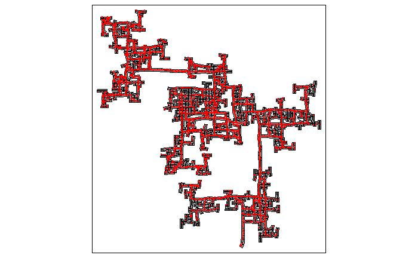
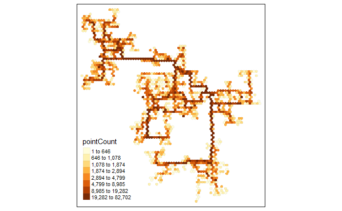
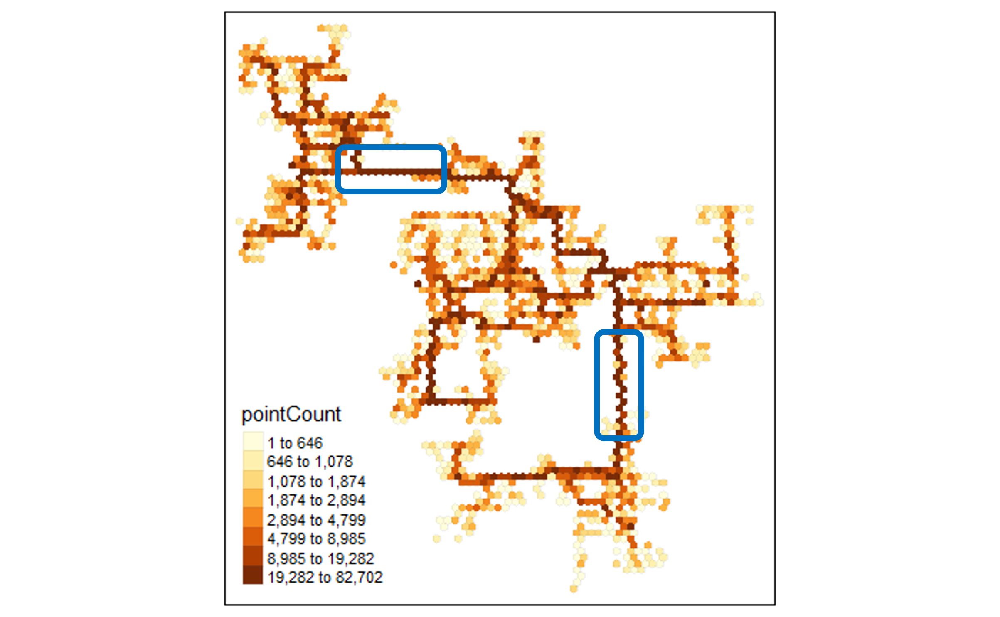

```{r setup, include=FALSE}
knitr::opts_chunk$set(echo = TRUE, evaluation = TRUE, message = FALSE, warning = FALSE, fig.retina = 3)

```

# 1. Overview

Take-home Exercise #5: Visualizing and Analyzing Geographic and Movement Data


## 1.1 The Task

In this exercise, we are going to reveal the social areas as well as to visualize and analyze locations with traffic bottleneck in the city of Engagement, Ohio USA. 

The data should be processed by using appropriate **tidyverse** family of packages and and other appropriate visual analytics methods.


# 2. Getting Started
## 2.1 Installing and loading the required libraries

Before we get started, it is important for us to ensure that the required R packages have been installed.  For the purpose of the exercise, the **tidyverse**, **sf**, and **tmap** packages will be mainly used.

The code chunk below is used to check if the necessary R packages are installed in R.  If they have yet, then RStudio will install the missing R package(s).  If are already been installed, then they will be loaded in R environment.

```{r}
packages = c('tidyverse', 'sf', 'tmap', 'lubridate', 'clock', 'sftime', 'rmarkdown')

for (p in packages){
  if(!require(p, character.only = T)){
    install.packages(p)
  }
}
```


# 3. Data Import
## 3.1 Import location attributes data

In this exercise, the location attributes data files including *Buildings*, *Apartments*, *Employers*, *Jobs*, *Pubs*, *Restaurants*, *Schools* csv files will be used.

The code chunk below imports the csv files into R environment by using *read_sf()* function from **sf** package which will read the *location* column into correct geospatial format.

```{r}

schools <- read_sf("data/Schools.csv", 
                   options = "GEOM_POSSIBLE_NAMES=location")

buildings <- read_sf("data/buildings.csv", 
                   options = "GEOM_POSSIBLE_NAMES=location")

pubs <- read_sf("data/pubs.csv", 
                   options = "GEOM_POSSIBLE_NAMES=location")

apartments <- read_sf("data/apartments.csv", 
                   options = "GEOM_POSSIBLE_NAMES=location")

employers <- read_sf("data/employers.csv", 
                   options = "GEOM_POSSIBLE_NAMES=location")

restaurants <- read_sf("data/restaurants.csv", 
                   options = "GEOM_POSSIBLE_NAMES=location")

jobs <- read_csv("data/jobs.csv")

```


## 3.2 Import multiple *ParticipantStatusLogs#.csv*

In this exercise, all the *ParticipantStatusLogs#.csv* data files in the *ActivityLog* folder will also be used.
Here we will re-use the consolidated status log for all participants  (ParticipantStatusLogs_all.rds) which were generated in previous take-home exercise.  

The code chunk below imports *ParticipantStatusLogs_all.rds* into R environment by using *read_rds()* function.

The code will also correct the date format, add in day column, filter out transport data, and finally save the selected data into rds format (logs_selected.rds ~900MB, not available in GitHub repo due to large file size) so that we do not need to read the original data file again. 

```{r, eval=FALSE}

logs <- read_rds("data/ActivityLogs/ParticipantStatusLogs_all.rds")
logs_selected <- logs %>%
  mutate(Timestamp = date_time_parse(timestamp, zone="", format = "%Y-%m-%dT%H:%M:%S")) %>%
  mutate(day=get_day(Timestamp)) %>%
  filter(currentMode == "Transport")
head(logs_selected)

write_rds(logs_selected[c(2:4, 13:14)], "data/ActivityLogs/logs_selected.rds")

```


Next, let us read the saved rds file using *read_rds()* function followed by converting the data to sf object with identified wkt column - currentLocation using *st_as_sf()* function.


```{r}
logs_selected_read <- read_rds("data/ActivityLogs/logs_selected.rds")

logs_selected_read <- st_as_sf(logs_selected_read, wkt = "currentLocation" )

head(logs_selected_read)

```


# 4. Data Wrangling
## 4.1 Update data type

Notice that rentalCost, maxOccupancy, numberOfRooms and some other numeric fields are not in the correct data type, so next we will convert these fields into the correct data type by using *mutate()* and *as.numeric()* functions.

```{r}
apartments <- apartments%>%
  mutate(rentalCost = as.numeric(rentalCost))%>%
  mutate(maxOccupancy = as.numeric(maxOccupancy))%>%
  mutate(numberOfRooms = as.numeric(numberOfRooms))
  
#print(apartments)

buildings <- buildings%>%
  mutate(maxOccupancy = as.numeric(maxOccupancy))
  
#print(buildings)

pubs <- pubs%>%
  mutate(hourlyCost = as.numeric(hourlyCost))%>%
  mutate(maxOccupancy = as.numeric(maxOccupancy))
  
#print(pubs)

restaurants <- restaurants%>%
  mutate(foodCost = as.numeric(foodCost))%>%
  mutate(maxOccupancy = as.numeric(maxOccupancy))
  
#print(restaurants)

schools <- schools%>%
  mutate(monthlyCost = as.numeric(monthlyCost))%>%
  mutate(maxEnrollment = as.numeric(maxEnrollment))
  
#print(schools)

jobs <- jobs%>%
  mutate(jobId = as.character(jobId))%>%
  mutate(employerId = as.character(employerId))
  
#print(jobs)

```


## 4.2 Merge jobs and employers data files

Next, we want to merge the jobs and employers data files with *merge()* function using common column employerId. 

We also need to convert the merged data to sf object using *st_as_sf()* function. 

```{r}
jobs_employers <- merge(jobs, employers, by="employerId")

jobs_employers <- st_as_sf(jobs_employers)
```


# 5. Data Visualization

## 5.1 Distinct areas in the city

Below code chunk visualizes the buildings and their shapes using relevant functions in **tmap** package. 

```{r}
tmap_mode("view")
tm_shape(buildings)+
tm_polygons(col = "grey60",
           size = 1,
           border.col = "black",
           border.lwd = 1)

```


To add in another layer of details we will differentiate the building types such as commercial, residential and school by different colors. 

We will next add in the geom points for apartments, employers, pubs, restaurants, and schools. 

It can be seen that the commercial buildings are mainly in the central areas in the city and are surrounded by residential buildings. 

Employers, pubs and restaurants are also mainly located in these commercial buildings.  

Schools are mainly located next to residential areas. 

```{r}
tmap_mode("view")
tm_shape(buildings)+
tm_polygons(col = "buildingType",
           palette="Accent",
           border.col = "black",
           border.alpha = .5,
           border.lwd = 0.5)+
tm_shape(employers) +
  tm_dots(col = "red") +
tm_shape(apartments) +
  tm_dots(col = "lightblue") +
tm_shape(pubs) +
  tm_dots(col = "green") +
tm_shape(restaurants) +
  tm_dots(col = "blue") +
tm_shape(schools) +
  tm_dots(col = "yellow")

```


Below code chunk visualizes the rental cost and no. of rooms for apartments in the city. 

We can see those apartments located in central areas or next to commercial buildings usually have higher rental cost which can be explained by the shorter distance to offices or work locations. 

Apartments in the rural areas of the city generally have lower rental cost and more rooms. 

```{r}

tmap_mode("view")
tm_shape(buildings)+
tm_polygons(col = "buildingType",
           palette="Accent",
           border.col = "black",
           border.alpha = .5,
           border.lwd = 0.5)+
tm_shape(apartments)+
tm_bubbles(col = "rentalCost",
           alpha = 0.8,
           n = 6,
           style = "jenks",
           palette="Purples",
           size = "numberOfRooms",
           scale = 0.8,
           border.col = "black",
           border.lwd = 0.5)

```

Below code chunk visualizes the hourly cost and max occupancy of pubs in the city. 

Pubs are mainly located in the commercial buildings and the 3 pubs in central areas i.e. pub-1342, pub-893, pub-894 have relatively higher cost and more occupancy, compared to those in the north-west and east areas. 

```{r}

tmap_mode("view")
tm_shape(buildings)+
tm_polygons(col = "buildingType",
           palette="Accent",
           border.col = "black",
           border.alpha = .5,
           border.lwd = 0.5)+
tm_shape(pubs)+
tm_bubbles(col = "hourlyCost",
           alpha = 0.8,
           n = 6,
           style = "jenks",
           palette="BuGn",
           size = "maxOccupancy",
           scale = 0.8,
           border.col = "black",
           border.lwd = 0.5)


```

Below code chunk visualizes the food cost and max occupancy of restaurants in the city.

We can see restaurant-447 in the south area seems to be the largest restaurant in the city also with relatively higher food cost. 
Surprisingly, in the central areas, there are a few restaurants offer quite competitive prices. 

We also notice that in certain residential areas such as east side and south side, there are no restaurant in the areas which probably indicates that residents in such areas tend to cook at home. 

```{r}
tmap_mode("view")
tm_shape(buildings)+
tm_polygons(col = "buildingType",
           palette="Accent",
           border.col = "black",
           border.alpha = .5,
           border.lwd = 0.5)+
tm_shape(restaurants)+
tm_bubbles(col = "foodCost",
           alpha = 0.8,
           n = 6,
           style = "jenks",
           palette="Blues",
           size = "maxOccupancy",
           scale = 0.8,
           border.col = "black",
           border.lwd = 0.5)


```

Below code chunk visualizes the monthly cost and max enrollment of schools. 

Among all the 4 schools, school-450 has the highest cost and also the highest enrollment counts. 

There's no school in the east area so we suspect the students and their parents have to travel a long distance to the schools in other area. 

```{r}
tmap_mode("view")
tm_shape(buildings)+
tm_polygons(col = "buildingType",
           palette="Accent",
           border.col = "black",
           border.alpha = .5,
           border.lwd = 0.5)+
tm_shape(schools)+
tm_bubbles(col = "monthlyCost",
           alpha = 0.8,
           n = 6,
           style = "jenks",
           palette="YlOrRd",
           size = "maxEnrollment",
           scale = 0.8,
           border.col = "black",
           border.lwd = 0.5)


```

Below code chunk visualizes the education requirements and hourly rate for jobs in the city.

Jobs (employers) are mainly located in the commercial buildings. 
There seems no distinct distribution of jobs based on education requirements meaning most of the commercial buildings have a mixture of different education requirements.

However, it can be seen that bachelors and graduates in general are hired with higher rate.  

```{r}
tmap_mode("view")
tm_shape(buildings)+
tm_polygons(col = "buildingType",
           palette="Accent",
           border.col = "black",
           border.alpha = .5,
           border.lwd = 0.5)+
tm_shape(jobs_employers)+
tm_bubbles(col = "educationRequirement",
           alpha = 0.8,
           n = 6,
           style = "jenks",
           palette="Reds",
           size = "hourlyRate",
           scale = 1.2,
           border.col = "black",
           border.lwd = 0.5)


```


## 5.2 Locations with traffic bottleneck

Below code chunk visualizes the movement data for all participants in the city. 
However, it's not clear enough to tell the traffic volume. 


```{r, eval=FALSE}
tmap_mode("plot")
tm_shape(buildings)+
tm_polygons(col = "grey60",
           size = 1,
           border.col = "black",
           border.lwd = 1) +
tm_shape(logs_selected_read) +
  tm_dots(col = "red")

```




To further visualize the traffic volumes in different locations, we will next create a hexagon binning map.

In the code chunk below, *st_make_grid()* of sf package is used to create haxegons.
*st_join()* of sf package performs point in polygon overlay and counts the number of event points in the hexagons.
*left_join()* of dplyr package is used to perform a left-join by using hex as the target table and points_in_hex as the join table. The join ID is hex_id.


```{r, eval=FALSE}
hex <- st_make_grid(buildings, 
                    cellsize=100, 
                    square=FALSE) %>%
  st_sf() %>%
  rowid_to_column('hex_id')


points_in_hex <- st_join(logs_selected_read, 
                        hex, 
                        join=st_within) %>%
  st_set_geometry(NULL) %>%
  count(name='pointCount', hex_id)
head(points_in_hex)


hex_combined <- hex %>%
  left_join(points_in_hex, 
            by = 'hex_id') %>%
  replace(is.na(.), 0)

```


In the code chunk below, tmap package is used to create the hexagon binning map.

```{r, eval=FALSE}
tm_shape(hex_combined %>%
           filter(pointCount > 0))+
  tm_fill("pointCount",
          n = 8,
          style = "quantile") +
  tm_borders(alpha = 0.1)
```






From the above hexagon binning map, we are concerned about 2 particular connections between the different areas of the city.

The 1st connection is between north-west and central areas and the 2nd connection is between south and east areas as highlighted in the graph. 

There are huge amount of traffic going through these 2 connections which are probably the only transportation connection e.g. highways or subways between the areas. 
If there's any accident occurred on these 2 connections, they would become the traffic bottlenecks causing breakdown of the transportation and movement in the city. We would like to suggest to increase the capacity of these 2 connections or build additional connections between areas in the city to improve the potential traffic bottleneck issue.  


```{r, eval=FALSE, echo=FALSE}
#Plotting Movement Path
logs_path <- logs_selected_read %>%
  group_by(participantId, day) %>%
  summarize(m = mean(Timestamp),
            do_union=FALSE) %>%
  st_cast("LINESTRING")

logs_path$temp_cnt = stringr::str_count(logs_path$currentLocation, ",")
logs_path <- logs_path %>%
  filter(temp_cnt > 1)


head(logs_path)
tmap_mode("plot")
tm_shape(buildings)+
tm_polygons(col = "grey60",
           size = 1,
           border.col = "black",
           border.lwd = 1) +
tm_shape(logs_path) +
  tm_lines(col = "blue")+
tm_facets(by="day")

```


