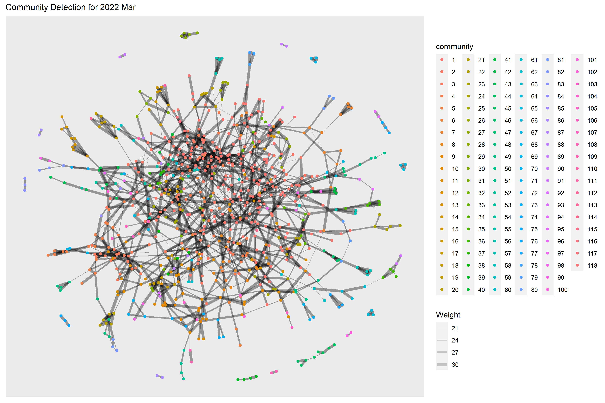
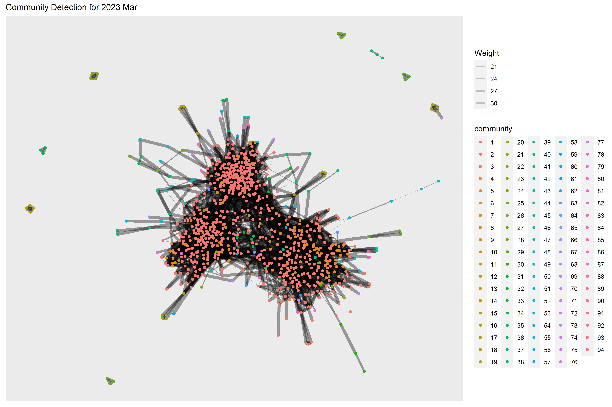

```{r setup, include=FALSE}
knitr::opts_chunk$set(echo = TRUE, evaluation = TRUE, message = FALSE, warning = FALSE, fig.retina = 3)

```

# 1. Overview

Take-home Exercise #6: Visualizing and Analyzing Community Network


## 1.1 The Task

In this exercise, we are going to reveal the patterns of community interactions of the city of Engagement, Ohio USA by using social network analysis approach. 

The data should be processed by using appropriate **tidyverse** family of packages and and other appropriate visual analytics methods.


# 2. Getting Started
## 2.1 Installing and loading the required libraries

Before we get started, it is important for us to ensure that the required R packages have been installed.  For the purpose of the exercise, the **tidyverse**, **igraph**, **tidygraph**, **ggraph** and **visNetwork** packages will be mainly used.

The code chunk below is used to check if the necessary R packages are installed in R.  If they have yet, then RStudio will install the missing R package(s).  If are already been installed, then they will be loaded in R environment.

```{r}
packages = c('igraph', 'tidygraph', 
             'ggraph', 'visNetwork', 
             'lubridate', 'clock',
             'tidyverse', 'ggmap', 'plotly')

for (p in packages){
  if(!require(p, character.only = T)){
    install.packages(p)
  }
}
```


# 3. Data Import
## 3.1 Import social network data

In this exercise, the social network data file *SocialNetwork.csv* will be used that contains information about participants’ evolving social relationships.

The code chunk below imports the csv file into R environment by using *read_csv()* function.

We will need to make sure the timestamp column is in correct date format using *as.Date()* function, and to re-code the participantId with prefix 'p' in front, else error will be encountered later when using tidygraph package to build the graph data model as the participantId contains integer 0. 

For this excercise, we would like to find out how the social relationships evolves during the study period, therefore we will look at 2 periods, i.e. starting month of the study period (2022 Mar) and one year later (2023 Mar) to compare the changes in social network.

Finally the selected social network data will be saved into 2 rds files which will be used in subsequent steps without reading in the entire social network data file. 

```{r, eval=FALSE}
socialNetwork <- read_csv("data/SocialNetwork.csv")
socialNetwork$timestamp <- as.Date(socialNetwork$timestamp, "%Y-%m-%d")
socialNetwork <- socialNetwork %>%
  mutate(participantIdFrom = paste0("p", participantIdFrom)) %>%
  mutate(participantIdTo = paste0("p", participantIdTo))

sn_selected_before <- socialNetwork %>%
  filter(timestamp >= "2022-03-01" & timestamp <= "2022-04-01")
sn_selected_after <- socialNetwork %>%
  filter(timestamp >= "2023-03-01" & timestamp <= "2023-04-01")
write_rds(sn_selected_before, "data/sn_selected_before.rds")
write_rds(sn_selected_after, "data/sn_selected_after.rds")
  
```

# 4. Data Wrangling

## 4.1 Prepare network edges data


First, let's read the saved 2 rds files using *read_rds()* function. 

Next, we will calculate the weight of edges using *group_by()* and *summarise()* functions, and we need to take a look at the summary statistics of edge weight using *summary()* function. 

```{r}

sn_selected_before <- read_rds("data/sn_selected_before.rds")
sn_selected_after <- read_rds("data/sn_selected_after.rds")

edges_before <- sn_selected_before %>%
  group_by(participantIdFrom, participantIdTo) %>%
    summarise(Weight = n()) %>%
  ungroup()
edges_after <- sn_selected_after %>%
  group_by(participantIdFrom, participantIdTo) %>%
    summarise(Weight = n()) %>%
  ungroup()

summary(edges_before$Weight)
summary(edges_after$Weight)

```
From the summary statistics, we can see that the minimum and maximum edge weight still remained the same after one year (1-32), median (13 to 14) and mean (14.5 to 15.21) only increased slightly after one year. 

The summary statistics do not seem to show significant changes in the social relationships, so we decide to look closer at the social network with edge weight > 20 (i.e. beyond the 75 percentile) which by right should demonstrate a relatively interconnected network. We want to verify if there's evolution after one year even in such interconnected network. 

```{r}
edges_before <- edges_before %>%
  filter(Weight > 20)
edges_after <- edges_after %>%
  filter(Weight > 20)

```


## 4.1 Prepare network nodes data

In this social network, each participant represents one node, so we need to include the attributes of these participants from the *Participants.csv* file. 

After file import, we will also update the participantId with prefix 'p' as what we did previously for edges data.

Since we are only looking at the network with participants who are actively socializing, it's likely not all participants belong to such network. So we will first construct our nodes data by extracting the unique participantId from the edges data, followed by left joining with participants attribute data.  

Now we have the required nodes data. 

```{r}
participants <- read_csv("data/Participants.csv")
participants <- participants %>%
  mutate(participantId = paste0("p", participantId))

nodes_before<- data.frame(participantId = c(edges_before$participantIdFrom, 
                                                     edges_before$participantIdTo)) %>% 
  unique()

nodes_before <- merge(x = nodes_before, y = participants, by = "participantId", all.x = TRUE)

nodes_after<- data.frame(participantId = c(edges_after$participantIdFrom, 
                                                     edges_after$participantIdTo)) %>% 
  unique()

nodes_after <- merge(x = nodes_after, y = participants, by = "participantId", all.x = TRUE)

```

# 5. Data Visualization

## 5.1 How social network evolves after one year

First, *graph_from_data_frame()* of **igraph** is used to covert the nodes and edges data frame into an igraph file format.  Next, *as_tbl_graph()* of **tidygraph** is used to convert the igraph file into tidygraph data model.

```{r}
sngraph_before <- graph_from_data_frame(edges_before, 
                                                vertices = nodes_before,
                                                directed = TRUE) %>%
  as_tbl_graph()

sngraph_after <- graph_from_data_frame(edges_after, 
                                                vertices = nodes_after,
                                                directed = TRUE) %>%
  as_tbl_graph()

```


Next, we want to rearrange the rows in the edges data to list those with the highest weight first, so *activate()* followed by *arrange()* are used.

```{r}
sngraph_before %>%
  activate(edges) %>%
  arrange(desc(Weight))

sngraph_after %>%
  activate(edges) %>%
  arrange(desc(Weight))
```

Now let's create the social network graph for 2022 Mar and 2023 Mar respectively.
The code chunk below uses *ggraph()*, *geom_edge_link()* and *geom_node_point()* to plot the network graphs. 

```{r}
ggraph(sngraph_before, layout = "nicely") +
  geom_edge_link(aes(width=Weight), 
                 alpha=0.2) +
  scale_edge_width(range = c(0.1, 1)) +
  geom_node_point() +
  theme_graph()+ 
  ggtitle("Social Network for 2022 Mar") +
  theme(plot.title = element_text(size = 12))

ggraph(sngraph_after, layout = "nicely") +
 geom_edge_link(aes(width=Weight), 
                 alpha=0.2) +
  scale_edge_width(range = c(0.1, 1)) +
  geom_node_point() +
  theme_graph()+ 
  ggtitle("Social Network for 2023 Mar")+
  theme(plot.title = element_text(size = 12))

```

From the above graphs, we can see that although the edge weight did not change much after one year but the no. of edges (degree) increases quite a lot, which indicates a large amount of increase in the participants interactions especially for those who did not have relationship before. The community network is evolving towards a more relatively "complete" network. 


## 5.2 Betweenness Centrality Comparison
Betweenness is a centrality measure of a node within a graph. Nodes that occur on many shortest paths between other nodes have higher betweenness than those that do not.

Next we will use *centrality_betweenness()* to calculate the betweenness of each node and represent the values in different colors in the network graph of 2022 Mar. 


```{r}

g1 <- sngraph_before %>%
  mutate(betweenness_centrality = centrality_betweenness()) %>%
  ggraph(layout = "fr") + 
  geom_edge_link(aes(width=Weight), 
                 alpha=0.2) +
  scale_edge_width(range = c(0.1, 1)) +
  geom_node_point(aes(colour = betweenness_centrality))+ 
  ggtitle("Betweenness centrality for 2022 Mar ") +
  theme(plot.title = element_text(size = 12))

g1+theme()
```

**plotly** is used to help create an interactive graph where we can further examine the betweenness centrality value of selected node. 

```{r}
ggplotly(g1)

```
Similar plots are created for 2023 Mar as well. 

```{r}

g2 <- sngraph_after %>%
  mutate(betweenness_centrality = centrality_betweenness()) %>%
  ggraph(layout = "fr") + 
  geom_edge_link(aes(width=Weight), 
                 alpha=0.2) +
  scale_edge_width(range = c(0.1, 1)) +
  geom_node_point(aes(colour = betweenness_centrality)) + 
  ggtitle("Betweenness centrality for 2023 Mar") +
  theme(plot.title = element_text(size = 12))

g2+theme()
```


```{r}
ggplotly(g2)

```

From the above graphs, we can see the highest betweenness centrality value dropped from 2022 Mar (~50,000) to 2023 Mar (~20,000), and in 2023 Mar the betweenness centrality has become more evenly distributed to the nodes. 

This means in 2022 Mar there exists nodes that occur on many shortest paths between other nodes but in 2023 Mar such nodes that occur on shortest paths have become fewer, which coincides with our previous findings that interactions especially for those who did not have relationship before have increased in 2023 Mar hence these participants/nodes able to connect to others directly instead of going through the bridges of other nodes contributing to their betweenness centrality. 


## 5.3 Community Detection

Next we would like to find out if there are any communities that can be detected among the social network. 

We will use the *group_edge_betweenness()* algorithm imbedded in **igraph** for community detection. 

Below code chunk performs the community detection for 2022 Mar. 118 communities have been detected. 

```{r, fig.height=8, fig.width=12, eval=FALSE}
g <- sngraph_before %>%
  mutate(community = as.factor(group_edge_betweenness(weights = Weight))) %>%
  ggraph(layout = "fr") + 
  geom_edge_link(aes(width=Weight), 
                 alpha=0.2) +
  scale_edge_width(range = c(0.1, 2)) +
  geom_node_point(aes(colour = community))  + 
  ggtitle("Community Detection for 2022 Mar") +
  theme(plot.title = element_text(size = 12))
g + theme()

```



Below code chunk performs the community detection for 2023 Mar. 94 communities have been detected. 

```{r, fig.height=8, fig.width=12, eval=FALSE}
g <- sngraph_after %>%
  mutate(community = as.factor(group_edge_betweenness(weights = Weight, directed = TRUE))) %>%
  ggraph(layout = "fr") + 
  geom_edge_link(aes(width=Weight), 
                 alpha=0.2) +
  scale_edge_width(range = c(0.1, 2)) +
  geom_node_point(aes(colour = community))  + 
  ggtitle("Community Detection for 2023 Mar") +
  theme(plot.title = element_text(size = 12))
g + theme()

```



From the graphs above, we are not really able to identify clear and obvious community groups in the social network for both time periods due to the large no. of communities detected.

However, the no. of detected communities dropped in 2023 Mar which also indicates a more interconnected network as compared to one year before. 


## 5.4 Social Network by Interest Group

Since we do not have a obvious community detection in previous step, we would like to examine further based on the participants attributes such as interest group to check if certain interest group has more interactions as well as how the interactions evolved after one year.

Below code chunk generates the network graph for 2022 Mar using *facet_nodes()* for different interest groups. 

```{r}
set_graph_style()
g <- ggraph(sngraph_before, 
            layout = "circle") +
  geom_edge_link(aes(width=Weight), 
                 alpha=0.2) +
  scale_edge_width(range = c(0.1, 1)) +
  geom_node_point(aes(colour = interestGroup), 
                  size = 1)+ 
  ggtitle("Social Network for 2022 Mar by Interest Groups") +
  theme(plot.title = element_text(size = 12))

g + facet_nodes(~interestGroup)
```

Below code chunk generates the network graph for 2023 Mar for different interest groups. 

```{r}
set_graph_style()
g <- ggraph(sngraph_after, 
            layout = "circle") +
  geom_edge_link(aes(width=Weight), 
                 alpha=0.2) +
  scale_edge_width(range = c(0.1, 1)) +
  geom_node_point(aes(colour = interestGroup), 
                  size = 1)+ 
  ggtitle("Social Network for 2023 Mar by Interest Groups") +
  theme(plot.title = element_text(size = 12))

g + facet_nodes(~interestGroup)

```
From the graphs above, we can see an obvious increase of interactions across all interest groups from 2022 to 2023, i.e. much more edges/links in each interest group although the range of edge weight did not change much. 

Certain interest groups such as A, G, and I have evolved towards a more "complete" network with much more interactions between each group member, as compared to other interest groups. 


## 5.5 Social Network by Education Level

Similarly, we would like to check if participants from certain education leven tend to form a closer community and have more interactions.

Below code chunk generates the network graph for 2022 Mar using *facet_nodes()* for different groups of education level. 

```{r}
set_graph_style()
g <- ggraph(sngraph_before, 
            layout = "circle") +
  geom_edge_link(aes(width=Weight), 
                 alpha=0.2) +
  scale_edge_width(range = c(0.1, 1)) +
  geom_node_point(aes(colour = educationLevel), 
                  size = 1)+ 
  ggtitle("Social Network for 2022 Mar by Education Level") +
  theme(plot.title = element_text(size = 12))

g + facet_nodes(~educationLevel)

```


Below code chunk generates the network graph for 2023 Mar using *facet_nodes()* for different groups of education level. 

```{r}
set_graph_style()
g <- ggraph(sngraph_after, 
            layout = "circle") +
  geom_edge_link(aes(width=Weight), 
                 alpha=0.2) +
  scale_edge_width(range = c(0.1, 1)) +
  geom_node_point(aes(colour = educationLevel), 
                  size = 1)+ 
  ggtitle("Social Network for 2023 Mar by Education Level") +
  theme(plot.title = element_text(size = 12))

g + facet_nodes(~educationLevel)

```

From both graphs, first we can clearly see a much closer community among those "high school or college" participants, and also a clear loose community among "low" education level participants who seldom interact with each other.  

Moreover, for "bachelors" and "Graduate" participant groups, both groups demonstrated increasing connections within the group after one year. 


## 5.6 Interactive Social Network Graphs

Next, we want to use **visNetwork** package to create an interactive network graph.

Since visNetwork requires nodes list to include an "id" column, and the edge list to  have "from" and "to" columns, we will first perform *rename()* of column name. 

visNetwork also looks for a field called "group" in the nodes object and colour the nodes according to the values of the group field so we will perform *mutate()* to copy interestGroup to a new column called group. 

```{r}
nodes_before_vis <- nodes_before %>%
  rename(id = participantId)%>%
  mutate(group = interestGroup)

edges_before_vis <- edges_before %>%
  rename(from = participantIdFrom)%>%
  rename(to = participantIdTo)


nodes_after_vis <- nodes_after %>%
  rename(id = participantId)%>%
  mutate(group = interestGroup)

edges_after_vis <- edges_after %>%
  rename(from = participantIdFrom)%>%
  rename(to = participantIdTo)
```

Below code chunk creates visNetwork graph for 2022 Mar with the nodes assigned to unique colour to each category in the interest group field.

The argument *nodesIdSelection* adds an id node selection and *selectedBy* also adds another selection of educationLevel. 

```{r}
visNetwork(nodes_before_vis,
           edges_before_vis) %>%
  visIgraphLayout(layout = "layout_with_fr") %>%
  visEdges(arrows = "to", 
           smooth = list(enabled = TRUE, 
                         type = "curvedCW")) %>%
  visOptions(highlightNearest = TRUE,
             nodesIdSelection = TRUE,
             selectedBy = list(variable ="educationLevel")) %>%
  visLegend() %>%
  visLayout(randomSeed = 123)

```

Below code chunk generates the similar interface visNetwork graph for 2023 Mar. 

```{r}
visNetwork(nodes_after_vis,
           edges_after_vis) %>%
  visIgraphLayout(layout = "layout_with_fr") %>%
  visEdges(arrows = "to", 
           smooth = list(enabled = TRUE, 
                         type = "curvedCW")) %>%
  visOptions(highlightNearest = TRUE,
             nodesIdSelection = TRUE,
             selectedBy = list(variable ="educationLevel")) %>%
  visLegend() %>%
  visLayout(randomSeed = 123)

```


# 6. Analysis and Insights

Below is the summary of analysis and insights of the social actives and social network patterns in the City of Engagement community. 

- The minimum and maximum edge weight did not change after one year, which is reasonable as the edge weight represents the count of interactions between two persons within one month. Since one interaction on one day is usually recorded once so maximum no. of interactions per month is ~30. 

- The median and mean of edge weight increased slightly after one year which indicates increased interactions among the community. 

- The no. of edges (degree) in the network graph increased quite a lot after one year, which indicates a large amount of increase in the participants interactions especially for those who did not have relationship before. 

- The betweenness centrality value dropped after one year and became more evenly distributed to the nodes in 2023 Mar. It means in 2022 there were nodes/participants that occur on many shortest paths between other participants and served as brides of other participants, however in 2023 Mar such nodes/participants have become fewer, which indicates that interactions especially for those who did not have relationship before have established hence these participants able to interact to others directly instead of going through the bridges of other participants.

- Using the selected community detection algorithm, we are not able to identify clear and obvious community groups in the social network for both time periods due to the large no. of communities detected. However, the no. of detected communities dropped in 2023 Mar which also indicates a more interconnected network as compared to one year before. 

- In order to identify community groups, we further checked the connections within interest groups. An obvious increase of interactions across all interest groups from 2022 to 2023 can be observed, i.e. much more edges/links in each interest group. Certain interest groups such as 'A', 'G', and 'I' have evolved towards a more "complete" network with much more interactions between each group member, as compared to other interest groups. 

- We also further checked the connections within groups of same education level. First we can clearly see a much closer group among those "high school or college" participants, and also a clear loose group among "low" education level participants who seldom interact with each other. Moreover, for "Bachelors" and "Graduate" participant groups, both groups demonstrated increasing connections within the group after one year. 

